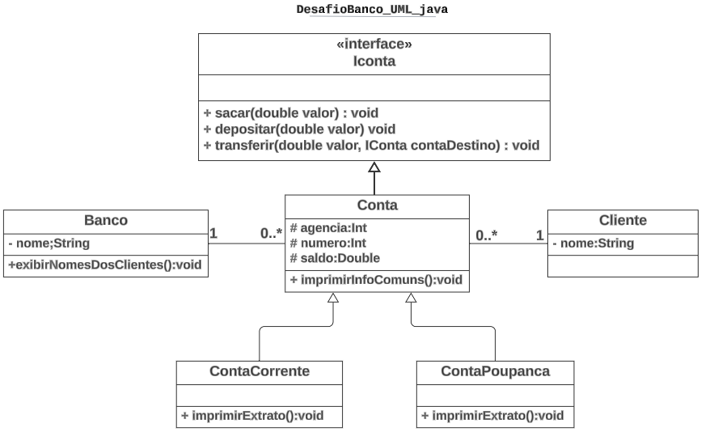

# Sistema Bancário Orientado a Objetos

Este projeto consiste na implementação de um Sistema Bancário utilizando os paradigmas da Orientação a Objetos em Java. O sistema inclui várias funcionalidades, como saque, depósito e transferências entre contas poupança e corrente.

## Diagrama de Classes UML

## Estrutura do Sistema

### Cliente e Contass
- Cada conta pertence a um cliente, e um cliente pode possuir várias contas.
- As contas são de dois tipos: Conta Corrente e Conta Poupança.

### Banco
- Um banco pode gerenciar várias contas, mas uma conta pertence a apenas um banco.
- A classe `Banco` inclui um método para exibir o nome de todos os clientes.

### Hierarquia de Classes
- A superclasse `Conta` implementa a interface `IConta`, que define os métodos básicos de uma conta bancária.
- As subclasses `ContaCorrente` e `ContaPoupança` estendem a classe `Conta`, especializando suas funcionalidades.

## Funcionalidades Implementadas
- **Saque**: Permite a retirada de dinheiro de uma conta.
- **Depósito**: Permite a adição de dinheiro a uma conta.
- **Transferência**: Permite a transferência de dinheiro entre contas (corrente e poupança).

## Objetivos do Projeto
- Demonstrar a aplicação dos princípios de Orientação a Objetos em um sistema real.
- Facilitar a compreensão de conceitos como herança, encapsulamento e polimorfismo através de um exemplo prático.